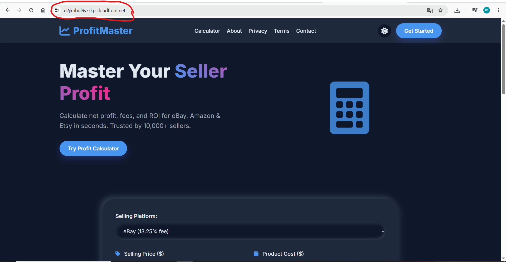
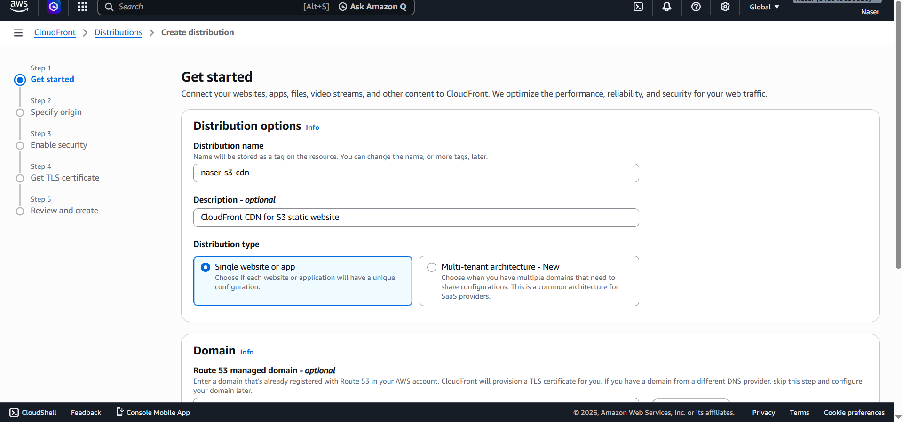
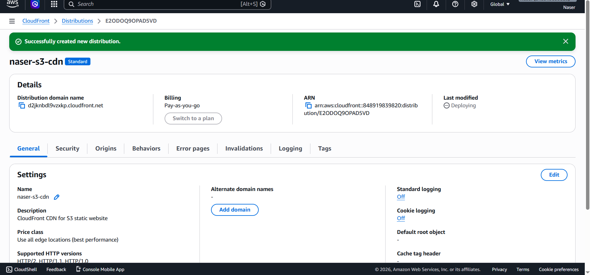
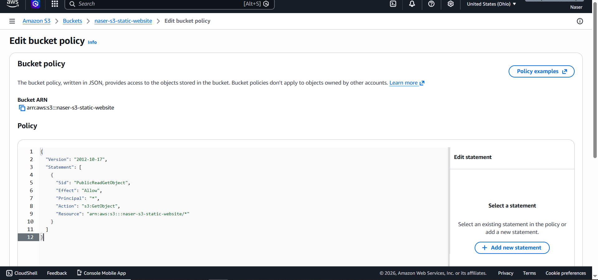
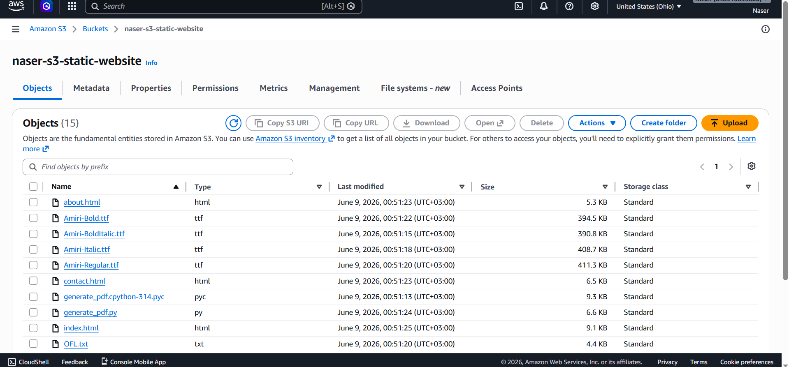

# ProfitMaster: AWS Cloud Infrastructure Journey

## Overview
This repository documents the deployment of the **ProfitMaster** project, a static website hosted on Amazon Web Services. The primary goal was to move from academic theory to hands-on cloud infrastructure management, focusing on security, scalability, and content delivery.

## Architecture Highlights
- **Storage:** Static website assets hosted on Amazon S3.
- **Content Delivery:** Amazon CloudFront used to globalize the content and enable HTTPS.
- **Security:** Implemented specific Bucket Policies to ensure the "Principle of Least Privilege."

## Implementation Journey
Below is the visual documentation of the infrastructure setup:

### 1. The Deployment Environment

### 2. Identifying the Security Challenge
Initially, the setup faced security warnings ("Not secure"), highlighting the need for a CDN.

### 3. Configuring CloudFront (CDN)
Setting up the distribution to ensure high availability and secure delivery.

### 4. Successful Deployment
Verification of the new distribution.

### 5. Access Control & Security
Deep dive into S3 Bucket Policies (JSON) to restrict access properly.

### 6. Project Structure
The organized file structure used for the deployment.

## Key Technical Skills Demonstrated
- **AWS S3:** Managing static web hosting and object permissions.
- **AWS CloudFront:** Implementing CDNs for low-latency performance and HTTPS enforcement.
- **Infrastructure Security:** Writing and debugging JSON-based Bucket Policies.
- **Problem Solving:** Transitioning from an unsecured bucket to a production-ready, secure environment.

---
*Created by Naser | Aspiring Cloud & Cybersecurity Engineer*
